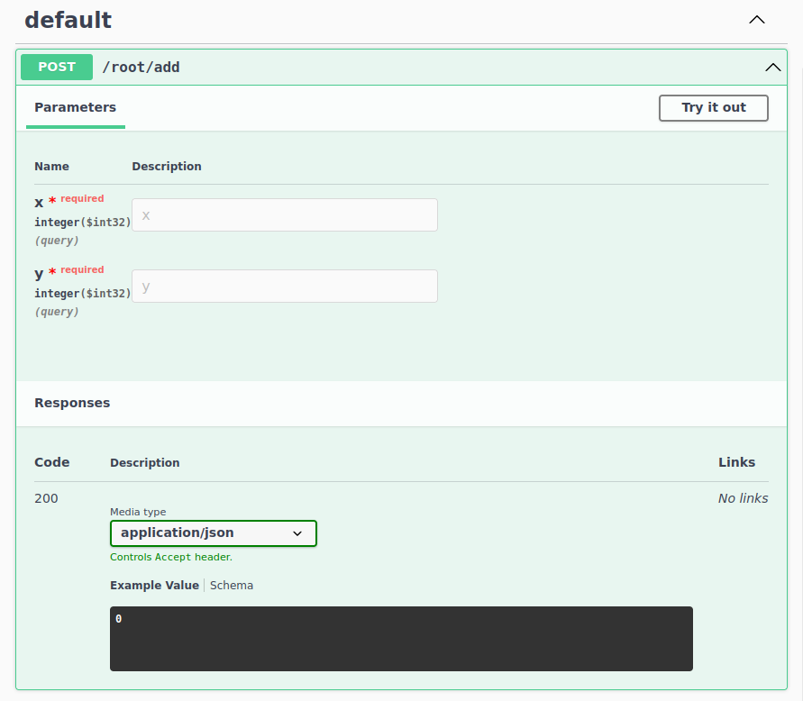

# wasm2openapi

Convert a [WASM Component](https://component-model.bytecodealliance.org/) into an OpenAPI definition and the
corresponding API server.

## Run

If you do not have an existing WASM Component, you can build one of the example ones from the `crates/components` folder.

For example, the `add` component:

```bash
cd crates/components/add
cargo component build --release
```

Any WASM Component can be converted to an OpenAPI definition:

```bash
cargo run -- --file ../../target/wasm32-wasi/release/add.wasm convert
```

You can also serve the Swagger UI of a WASM Component:

```bash
cargo run -- --file ../../target/wasm32-wasi/release/add.wasm serve --swagger
```


